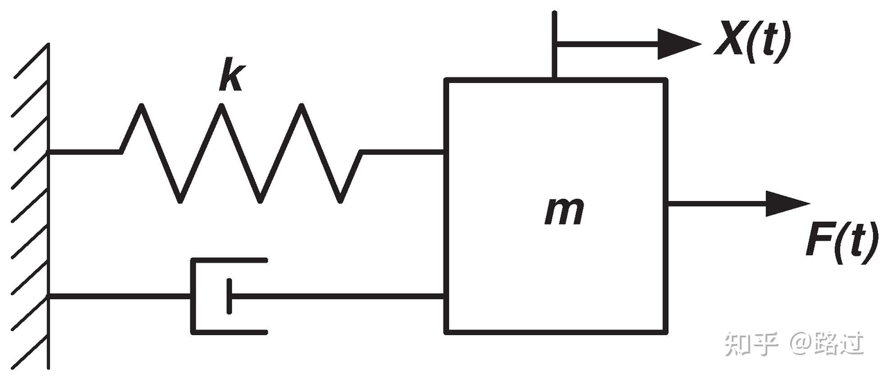

##  经典引入

下面以经典的质量-弹簧-阻尼系统为例，说明状态空间矩阵的构建过程及其物理含义。

---
### 系统描述
弹簧阻尼系统的微分方程来源于牛顿第二定律（或达朗贝尔原理）结合弹簧力与阻尼力的物理模型。

---

### 受力分析
取质量块$m$为研究对象，规定位移$x$向右为正。  
作用在质量块上的力有：
- 弹簧力 $F_k$
弹簧满足胡克定律：力与位移成正比，方向与位移相反。
当位移为 $x$时，弹簧力 $F_k = -kx$（负号表示恢复力，始终指向平衡位置）。
- 阻尼力$F_c$
粘性阻尼力与速度成正比，方向与速度相反。
当速度为 $\dot{x}$时，阻尼力 $F_c = -c \dot{x}$。
- 外力$u(t)$
由外部施加，方向与正方向一致。

#### 牛顿第二定律
合外力等于质量乘以加速度：
$$\sum F = m \ddot{x}$$
代入各力（注意符号）：
$$u(t) - k x - c \dot{x} = m \ddot{x} $$

#### 整理得微分方程
质量为 $m$ 的物体，受到弹簧刚度$k$、阻尼系数$c$ 和外部作用力$u(t)$ 的作用。系统的动力学方程为：
$$m \ddot{x}(t) + c \dot{x}(t) + k x(t) = u(t) $$
（如果你现在在学大物上，会发现这个方程和阻尼振动很有关系）

---
### 状态变量选取
选取状态变量为位移和速度：（状态变量由自己设置）
$$x_1(t) = x(t), \quad x_2(t) = \dot{x}(t) $$

---
### 状态方程与输出方程
由动力学方程可得：
$$\dot{x}_1 = x_2$$
$$\dot{x}_2 = -\frac{k}{m}x_1 - \frac{c}{m}x_2 + \frac{1}{m}u$$
假设输出为位移：
$$y(t) = x_1(t)$$
写成矩阵形式：
$$\begin{bmatrix}
\dot{x}_1 \\ \dot{x}_2
\end{bmatrix}
=
\begin{bmatrix}
0 & 1 \\
-\frac{k}{m} & -\frac{c}{m}
\end{bmatrix}
\begin{bmatrix}
x_1 \\ x_2
\end{bmatrix}
+
\begin{bmatrix}
0 \\ \frac{1}{m}
\end{bmatrix}
u(t) $$

$$y(t) =
\begin{bmatrix}
1 & 0
\end{bmatrix}
\begin{bmatrix}
x_1 \\ x_2
\end{bmatrix}
+0 \cdot u(t) $$

### 状态空间矩阵

$$\mathbf{A} = \begin{bmatrix} 0 & 1 \\ -\frac{k}{m} & -\frac{c}{m} \end{bmatrix},\quad
\mathbf{B} = \begin{bmatrix} 0 \\ \frac{1}{m} \end{bmatrix},\quad
\mathbf{C} = \begin{bmatrix} 1 & 0 \end{bmatrix},\quad
\mathbf{D} = 0 $$

---
##  自动控制原理
自动控制原理的核心之一即为 **传递函数**。传递函数用以描述线性定常系统的输出与输入对应变换关系，其定义式表达为（在拉普拉斯变换域下）
$$
G(s)=\frac{Y(s)}{R(s)}
$$
对应于上面的例子，我们很容易由牛顿第二定律
$$m \ddot{x}(t) + c \dot{x}(t) + k x(t) = u(t) $$
进行拉普拉斯变换后得出传递函数
$$
G(s) = \frac{1}{ms^2+bs+k}
$$
对应输入$R(s)=U(s)$，输出$Y(s)=X(s)$

---

## 现代控制理论

在现代控制理论中，传递函数的代数表达式对应的矩阵形式被称为**传递函数阵**。

回到状态空间表达式$\dot{x}=Ax+Bu$，左右进行拉式变换得$sX(s)=AX(s)+Bu(s)$。移项整理后得到$X(s)=(sI-A)^{-1}BU(s)$

同样对输出方程拉式变换$Y(s)=CX(s)+DU(s)$把上面的$X(s)$表达式带入得到$Y(s)=C(sI-A)^{-1}BU(s)+DU(s)$

从而传递函数阵$$G(s)=\frac{Y(s)}{U(s)}=C(sI-A)^{-1}B+D$$

---

现在计算$(sI-A)^{-1}$：$(sI-A)^{-1}=\frac{(sI-A)^{*}}{|sI-A|}$，在上面的弹簧阻力质量系统中$\mathbf{A} = \begin{bmatrix} 0 & 1 \\ -\frac{k}{m} & -\frac{c}{m} \end{bmatrix}$，则
$$
(sI-A)^{-1}=\frac
{\begin{bmatrix} 
s+\frac{b}{m} & 1 \\
-\frac{k}{m} & s \\
\end{bmatrix}}{s(s+\frac{B}{m})-(-1)\frac{k}{m}}=\frac
{\begin{bmatrix} 
s+\frac{b}{m} & 1 \\
-\frac{k}{m} & s \\
\end{bmatrix}}{s^2+\frac{B}{m}s+\frac{k}{m}}
$$

左乘矩阵$C$：
$$
C(sI-A)^{-1}=\begin{bmatrix} 1 & 0\end{bmatrix}\frac
{\begin{bmatrix} 
s+\frac{b}{m} & 1 \\
-\frac{k}{m} & s \\
\end{bmatrix}}{s^2+\frac{B}{m}s+\frac{k}{m}}
=
\frac
{\begin{bmatrix} 
s+\frac{b}{m} & 1 \\

\end{bmatrix}}{s^2+\frac{B}{m}s+\frac{k}{m}}
$$
再右乘矩阵$B$，并加上矩阵$D$（对应0）：
$$
C(sI-A)^{-1}B+D=\frac{\frac{1}{m}}{s^2+\frac{B}{m}s+\frac{k}{m}}+0
=\frac{1}{ms^2+bs+k}
$$
形式与代数一模一样

---
## 分析
1. 他们形式能一致，是因为我们将其当作一个SISO系统处理，此时传递函数矩阵退化为一个 $1X1$的标量矩阵，而这个标量就是传统的传递函数
2. 我们发现${ms^2+bs+k}$这段式与$|sI-A|$息息相关，而如果把$s$替换为$\lambda$，很容易发现这就是求$A$矩阵特征值的公式；而分母的解在传递函数中又代表着极点。那么我们可以得出结论：**$A$矩阵的特征值即为传递函数的极点，与系统稳定性息息相关**