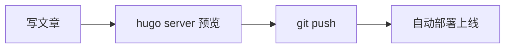

本教程面向本博客的技术栈：**Hugo（静态站点生成器）+ Stack 主题**。读完你会知道怎么在本地写文章预览、怎么配置主题、以及怎么把内容发布到 GitHub Pages。

## 1. Hugo 是什么

Hugo 是一个用 Go 语言写的**静态站点生成器**。你把 Markdown 文章丢进去，它瞬间生成一堆 HTML 文件，然后传到任意静态托管平台（这里用的 GitHub Pages）就能访问。

特点：

- **快**：几百篇文章也是毫秒级构建
- **无数据库**：所有内容就是仓库里的 `.md` 文件，用 git 管理
- **Markdown 写作**：专注内容，不用碰网页代码

本博客使用 **Stack 主题**（`hugo-theme-stack`），一个简洁、功能全面的中文友好主题。

## 2. 项目结构

```
hugo-stack-blog/
├── assets/
│   ├── img/
│   │   ├── avatar.png      # 侧边栏头像
│   │   └── favicon.png     # 网站图标
│   └── scss/
│       └── custom.scss     # 自定义样式（可覆盖主题）
├── config/
│   └── _default/           # 站点配置
│       ├── config.toml     # 核心配置（标题/语言/主题）
│       ├── params.toml     # 主题参数（侧边栏/评论/组件）
│       ├── menu.toml       # 主菜单 + 社交链接
│       ├── markup.toml     # Markdown 渲染
│       ├── permalinks.toml # URL 规则
│       └── related.toml    # 相关文章
├── content/
│   └── post/               # 所有文章都放这里
│       └── my-post/
│           └── index.md    # 一篇文章（图片放同目录）
├── themes/
│   └── hugo-theme-stack/   # 本地主题（离线使用，不联网下载）
└── .github/workflows/
    └── deploy.yml          # 推送后自动部署
```

## 3. 本地预览

在**项目根目录**运行：

```bash
cd /home/lhxy/selfdoc/hugo-stack-blog
hugo server
```

然后浏览器打开 `http://localhost:1313/`。改文件保存后页面自动刷新。

其他常用命令：

```bash
hugo server --buildDrafts   # 连草稿一起预览
hugo server -D --port 8080  # 指定端口
hugo                        # 生成静态文件到 public/
hugo --gc --minify          # 构建并压缩（部署时用）
```

> 本博客已改用**本地主题**（`themes/` 目录），不需要联网下载，`go` 也不用装。

## 4. 写一篇文章

### 4.1 创建文章

在根目录执行（会自动生成带 front matter 的文件）：

```bash
hugo new content/post/我的文章/index.md
```

或者直接手动新建 `content/post/xxx/index.md`。**每篇文章一个目录**，图片放进同目录，正文写在 `index.md`。

### 4.2 front matter（文章头部信息）

```yaml
---
title: 文章标题
description: 列表页和分享时显示的简介
slug: my-post               # 可选，URL 地址（不填用文件名）
date: 2026-08-10 00:00:00+0000
image: cover.jpg            # 封面图（放在同目录）
categories:
    - 教程
tags:
    - Hugo
    - Stack
weight: 1                   # 可选，weight 越小越靠前（设 -1 可置顶）
math: false                 # 设为 true 开启数学公式支持
toc: true                   # 是否显示目录
comments: true              # 是否允许评论
draft: true                 # true = 草稿，发布时删掉或改成 false
featured: false             # 可选，首页大图展示
hidden: false               # true 则从列表中隐藏
build:
    list: always            # "always" 显示在列表 / "never" 隐藏
---
```

封面图也可以写成更完整的形式：

```yaml
cover:
    image: "1.jpg"
    caption: "图片说明文字"
    alt: "无障碍描述"
    relative: false
    hidden: false
```

### 4.3 Markdown 写作

正常的 Markdown 语法都能用，Stack 额外支持：

**引用块**（带不同语气图标）：

```
> [!note] 这是一条备注
> [!tip] 这是一个小技巧
> [!warning] 这是一条警告
> [!caution] 注意安全
```

**代码块**（自动高亮 + 一键复制按钮）：

````
```python
print("hello")
```
````

**图片画廊**：连续两张图片之间用空行，主题会自动组合成画廊。

### 4.4 短代码（Shortcodes）

Stack 内置了常用外链嵌入短代码：

| 短代码 | 用途 | 示例 |
|---|---|---|
| `youtube` | YouTube 视频 | `` |
| `bilibili` | B 站视频 | `` |
| `video` | 本地视频 | `` |
| `quote` | 文艺引用 | `...` |

### 4.5 数学公式

在 front matter 里设 `math: true`，然后用 `$...$`（行内）和 `$$...$$`（独立行）：

行内公式 $a^2 + b^2 = c^2$

$$e^{i\pi} + 1 = 0$$


```
行内公式 $a^2 + b^2 = c^2$

$$e^{i\pi} + 1 = 0$$

```

### 4.6 Mermaid 图表

不需要额外配置，直接在代码块里写 `mermaid`：



````

````

## 5. 主题配置

配置文件都在 `config/_default/` 下，改完保存即可生效（本地预览自动刷新）。

### 5.1 config.toml — 核心配置

```toml
baseurl = "https://CJY719HNU.github.io/"   # 站点域名
title   = "CJY719HNU"                      # 站点标题（侧边栏名字）
theme   = "hugo-theme-stack"               # 本地主题
locale  = "zh-CN"                          # 语言
defaultContentLanguage = "zh"              # 默认内容语言
hasCJKLanguage = true                      # 中文排版优化
```

### 5.2 params.toml — 主题参数

```toml
mainSections = ["post"]    # 首页展示的文章目录

[sidebar]
    emoji    = "🍥"        # 头像右上角的小表情
    subtitle = "CJY719HNU 的个人博客"   # 站点副标题
    avatar   = "img/avatar.png"        # 头像路径

[footer]
    since = 2026            # 页脚起始年份

[colorScheme]
    toggle  = true          # 显示深浅色切换按钮
    default = "auto"        # 默认跟随系统

[comments]
    enabled  = true
    provider = "utterances" # 评论系统，见第 6 节

[widgets]                   # 首页/页面右侧栏小组件
    homepage = [
        { type = "search" },
        { type = "archives", params = { limit = 5 } },
        { type = "categories", params = { limit = 10 } },
        { type = "tag-cloud", params = { limit = 10 } },
    ]
    page = [{ type = "toc" }]
```

### 5.3 menu.toml — 主菜单与社交链接

```toml
# 主菜单（顶部导航）
[[main]]
    identifier = "archives"
    name       = "归档"
    url        = "/archives/"
    weight     = 1

# 社交链接（侧边栏图标，GitHub 等）
[[social]]
    identifier = "github"
    name       = "GitHub"
    url        = "https://github.com/CJY719HNU"

    [social.params]
        icon = "brand-github"
```

### 5.4 头像与图标

- **头像**：替换 `assets/img/avatar.png`（建议正方形，如 150×150 或 300×300）
- **站点图标**：替换 `assets/img/favicon.png`
- 替换后推送即可，配置里的路径不用改

### 5.5 custom.scss — 自定义样式

想改主题默认样式，写在 `assets/scss/custom.scss`：

```scss
/* 把主标题改成蓝色 */
.site-name { color: #3b82f6; }

/* 修改全局字体 */
body { font-family: "PingFang SC", "Microsoft YaHei", sans-serif; }

/* 给文章卡片加圆角 */
.article-card { border-radius: 12px; }
```

## 6. 评论系统（Utterances）

本博客评论用的是 **Utterances**：访客用 GitHub 账号登录评论，评论以 **Issue** 形式存在你的 GitHub 仓库里，方便管理，无需数据库。

配置在 `params.toml`：

```toml
[comments]
    enabled  = true
    provider = "utterances"

    [comments.utterances]
        repo      = "CJY719HNU/CJY719HNU.github.io"   # 存放评论 Issue 的仓库
        issueTerm = "pathname"
        label     = "comment"
```

> 第一次有访客评论时，需要在 GitHub 上授权 Utterances 访问你的仓库，它会自动创建 Issue。

## 7. 发布部署（GitHub Pages）

本博客已经配置好了 **GitHub Actions 自动部署**。发布流程：

```bash
# 1. 改完内容后提交并推送
git add -A
git commit -m "写新文章"
git push selfblog main
```

推送后 GitHub Actions 自动：构建站点 → 上传到 GitHub Pages → 约 1~2 分钟上线。

- 站点地址：`https://CJY719HNU.github.io/`
- 想自己手动构建：`hugo --gc --minify`，产物在 `public/`（已被 git 忽略）

### 关于草稿

- 文章设了 `draft: true` 时，**推送后不会上线**
- 本地用 `hugo server --buildDrafts` 预览
- 确认没问题后把 `draft: true` 删掉（或改成 `false`）再推送

## 8. 常见问题

**Q：线上显示的是旧内容？**
A：先硬刷新浏览器（`Ctrl+Shift+R`）。部署后 GitHub 的 CDN 可能要等一两分钟。

**Q：改了配置没生效？**
A：确认改的是 `config/_default/` 下的文件；`hugo server` 开着时会自动重载，但偶尔需要重启一次。

**Q：怎么更新主题？**
A：本博客用的是**本地主题**（`themes/hugo-theme-stack`），不会自动更新。想升级就手动替换该目录为新版本。

**Q：头像不显示？**
A：确认文件在 `assets/img/avatar.png`，且推送后等待部署完成。图片建议正方形。

---

Happy blogging! 🚀
